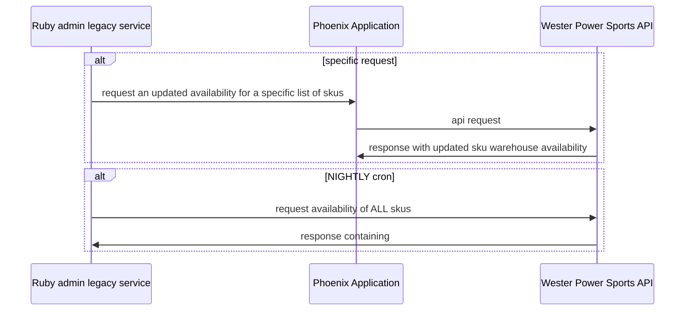

### SHIPPING VENDOR INTEGRATION

I Implemented A new inventory availability integration feature between a legacy ruby codebase, a Pheonix Elixir codebase and a new 3rd party api.

#### Problem

WE had a cron job running nightly to gather the up-to-date status of the warehouse locations, availability and quantity from a vendor, whose product we sold in our online store. The cron job updated ALL skus.

The vendor had implemented a new RESTful api

When a user was in a particular step of the ordering process we needed to check the availability of specific SKUS to ensure the information was correct as of the time of purchase.  

#### Solution

- I communicated with Multiple developers to determine strategy
- implemented a ruby client on the admin side to make a request call to the Phoenix service  on the front end with tests.
- Implemented new routing, endpoint and handlers on the Phoenix side with tests
- discovered appropriate vendor API request to make, attempting to be as transactional and performant as possible

<!--more-->

###  systems 

- our admin system (built on ruby 1.8.x)
- our customer facing Phoenix/Elixir site
- They share the database, but not in a meaningful way. There were a lot of
  hand built queries for custom work.
- Western Power Sports RESTful api

### obstacles

- tickets not documented, and was primarily tribal knowledge and had to be discovered by conversation with multiple parties as questions arose.
- The phoenix handlers were hundreds of lines long, with multiple async calls to WPS for all products, written by a cross-trained ruby dev.
- Changed teams after getting part way through work, the new team lead was first time leading, had only been at the company for 6 months, had very little experience with Elixir.

### Implementation

#### On the ruby side (originating request)

- I had to discover the effective calls for a filtered set of skus
- updated to call internal api, which wasnt a common pattern as opposed to calling WPS directly
- had to generate the routing on the elixir side to allow for the request to come through to the correct handler.
- added tests.

#### On the Phoenix side:

- differentiated long single cron job part of the work, protected from breaking it (brittle)
- Broke up the handler, added some pipelining , `with` structures and function heads and to clarify and recompose for future business cases.
- added tests and call for WPS endpoint with required data, and response structure.
- turned 3 call response cycles to 1 call for filtered skus, reducing overhead since calls were triggered by a customer ordering, and working out shipping ad hoc.
<!--more-->
